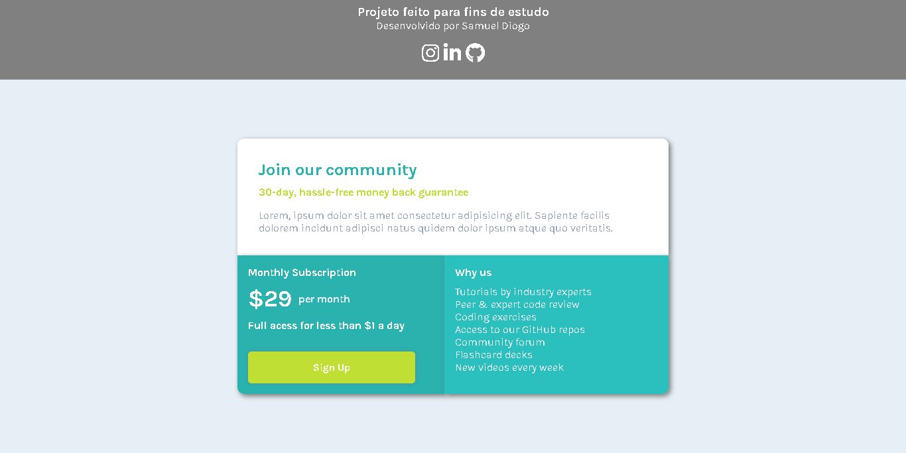

# single-price-grid-frontendMentor
Desafio: single price grid frontendMentor NEWBIE

### The challenge

Users should be able to:

- View the optimal layout for the component depending on their device's screen size
- See a hover state on desktop for the Sign Up call-to-action

## Built with

- Semantic HTML5 markup
- CSS custom properties
- Flexbox
- CSS Grid
- Mobile-first workflow

## Layout

The designs were created to the following widths:

- Mobile: 375px
- Desktop: 1440px

# Resources

[x] HTML, CSS.
[x] Images (PNG).